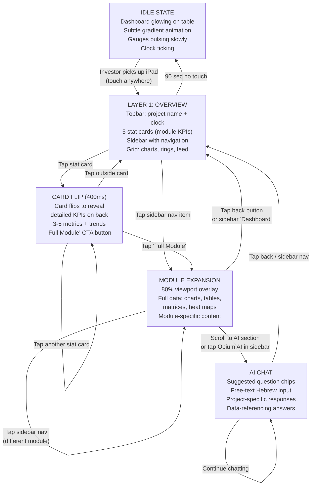
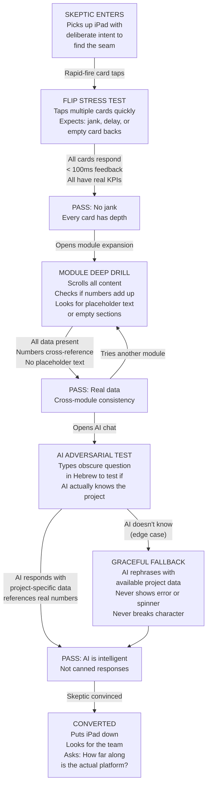
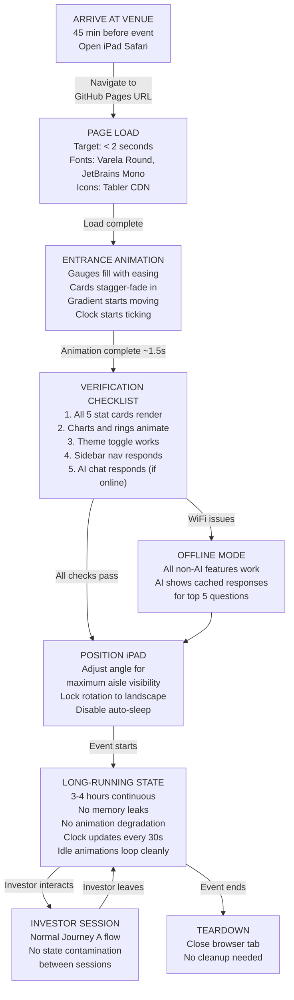

---
stepsCompleted:
  - 1
  - 2
  - 3
  - 4
  - 5
  - 6
  - 7
  - 8
  - 9
  - 10
  - 11
  - 12
  - 13
  - 14
lastStep: 14
inputDocuments:
  - user-data/product-brief-v2.md
  - _bmad-output/planning-artifacts/prd.md
  - user-data/dashboard-build-document.md
documentCounts:
  briefs: 1
  research: 1
  projectDocs: 1
projectName: 'optiplan-dashboard'
date: '2026-02-22'
author: 'BenAkiva'
---

# UX Design Specification optiplan-dashboard

**Author:** BenAkiva
**Date:** 2026-02-22

---

## Executive Summary

### Project Vision

OptiPlan Interactive Dashboard is a high-fidelity, touch-first investor demo designed to showcase the OptiPlan platform at a live angel investor conference (Jaffa, February 24, 2026). It simulates the OptiPlan Hub Dashboard — the central command center for managing civil engineering infrastructure projects — using a single fictitious transit project (Metro Line Extension, Gush Dan, 22 km, 6 sections, NTA client, 1.8B NIS).

The primary goal is emotional impact: investors must leave feeling OptiPlan is a revolutionary, investable product. The dashboard achieves this through a 3-layer progressive disclosure model (overview > card-flip KPIs > full module expansion), cinematic-quality animations, premium visual design ("Calvin Klein, not Ralph Lauren"), and a live AI chat in Hebrew that demonstrates platform intelligence.

Target deployment: single HTML file on GitHub Pages. Vanilla HTML/CSS/JS. iPad landscape optimized. Hebrew RTL. All data hardcoded.

### Target Users

This demo serves four distinct investor personas:

1. **"The Drive-By" (90 seconds)** — Glances from across the room, picks up the iPad briefly. Needs visual magnetism at idle and instant self-explanatory clarity without narration.
2. **"The Deep Diver" (8+ minutes)** — Methodical explorer who drills into every module. Needs full depth across all 5 modules, realistic data, and AI chat that impresses.
3. **"The Skeptic" (looking for the seam)** — Experienced investor testing where the facade ends. Needs zero dead ends, cross-module data consistency, and AI that handles adversarial questions.
4. **"The Operator" (setup & monitoring)** — BenAkiva setting up before the event. Needs fast load, long-running stability (3-4 hours), zero maintenance during the conference.

### Key Design Challenges

1. **Three audiences, one flow.** A single interaction flow must satisfy the 90-second Drive-By, the 8-minute Deep Diver, and the seam-hunting Skeptic without compromise.
2. **Idle-state magnetism.** The dashboard must be visually compelling from 3+ meters away when unattended — designing for passive visual attraction, not just active interaction.
3. **Premium feel on constrained tech stack.** Cinematic 60fps animations with vanilla HTML/CSS/JS on iPad Safari, no framework safety nets.
4. **Self-explanatory Hebrew data dashboard.** Complex infrastructure data (permit matrices, risk heat maps, cash flow charts) must be understandable by non-technical investors within seconds, in Hebrew RTL, without narration.
5. **AI as the climax moment.** Live AI chat must feel like a knowledgeable project advisor, handle adversarial questions in Hebrew, and fail gracefully to cached responses without visible error states.

### Design Opportunities

1. **3-layer progressive disclosure** rewards curiosity with depth — mirroring the platform's own value proposition of holistic view with drill-down detail.
2. **Touch physicality as differentiation** — card-flip interactions create a sensory, tactile experience that slide decks and Figma prototypes cannot match.
3. **Tooltip copy as silent sales pitch** — the "screaming the pain without saying it" philosophy embeds the sales narrative directly into the interface without ever feeling like a pitch.

## Core User Experience

### Defining Experience

The core experience of optiplan-dashboard is **curiosity-driven progressive disclosure**. The investor's primary action is a tap-to-explore loop: see something compelling > tap > discover depth > tap deeper > discover more. Each layer rewards curiosity with richer, more specific data — pulling the investor from passive observer to active explorer.

The defining interaction is the **Layer 1 > Layer 2 card flip**. This is the conversion moment — where visual attraction becomes active engagement. The flip must feel physical, tactile, and satisfying. It transforms a "pretty dashboard" into "something I want to explore." Every subsequent interaction (module expansion, AI chat) depends on this gateway feeling right.

The core loop: **Idle magnetism > First tap (card flip) > Depth discovery (expansion) > AI climax > Conviction.**

### Platform Strategy

| Dimension | Decision | Rationale |
|-----------|----------|-----------|
| **Primary platform** | iPad Safari, landscape orientation | Conference table demo — the only context that matters |
| **Input model** | Touch-first, zero hover dependency | Investors pick up and tap; no mouse, no keyboard (except AI chat free-text) |
| **Touch targets** | Minimum 44x44px (Apple HIG) | Non-negotiable for fat-finger reliability at a conference |
| **Offline capability** | All non-AI features work without network | Conference WiFi is unreliable; the demo must never break |
| **Tech stack** | Vanilla HTML/CSS/JS, single file | Zero-dependency deployment, fastest build velocity, GitHub Pages compatible |
| **RTL** | Full Hebrew RTL with Heebo font | Israeli investor audience, non-negotiable |
| **Animation engine** | CSS transitions + GPU-composited properties only (transform, opacity) | 60fps on iPad hardware without framework overhead |

### Effortless Interactions

These interactions must feel completely natural and require zero thought:

1. **Layer navigation** — Tap in, tap back, tap another module. The investor should never feel lost or wonder "how do I get back?" The back affordance must be instantly visible and reachable.
2. **Card flip** — Tap any module card, it flips with physical weight (~400ms). No ambiguity about what's tappable. No delay between tap and response (<100ms visual feedback).
3. **Module expansion** — Tap "full module" and the card opens cinematically (~500ms). Content is immediately readable — no loading states, no spinners (data is hardcoded).
4. **AI chat suggested questions** — Pre-written questions appear as tappable chips. One tap = instant question submission. Zero typing required for the basic experience.
5. **Idle return** — If nobody touches the dashboard for a period, it should remain visually alive and inviting. No screensaver, no dimming, no "session expired."

### Critical Success Moments

| Moment | Persona | What Happens | If It Fails |
|--------|---------|-------------|-------------|
| **Visual magnetism** | Drive-By | Investor notices the glowing dashboard from across the room and walks over | Nobody approaches the table — the demo is invisible |
| **First card flip** | All | Investor taps a card, it flips smoothly revealing real KPIs | Jank or delay shatters the premium illusion instantly |
| **Data depth discovery** | Deep Diver | Expanded module reveals permit matrices, cash flow charts, risk heat maps with realistic data | Shallow content or placeholders break credibility |
| **AI "holy shit" moment** | Deep Diver / Skeptic | AI responds in Hebrew with project-specific intelligence referencing real data points | Chatbot-like generic response or visible error kills the narrative |
| **No seam found** | Skeptic | Every module has depth, every number cross-references, every interaction leads somewhere | Finding a dead end or inconsistent data = "it's just a prototype" |
| **Hours of stability** | Operator | Dashboard runs 3-4 hours without crashes, memory leaks, or degradation | Crash during the event = catastrophic |

### Experience Principles

1. **Every tap earns trust.** Each interaction must deliver something real — a smooth animation, a meaningful KPI, a coherent AI response. No dead taps, no empty states, no "coming soon." Trust is built tap by tap and destroyed in one bad moment.

2. **The dashboard speaks before anyone does.** The interface must be self-explanatory — an investor who picks up the iPad with zero context should understand "this is a command center for infrastructure projects" within 30 seconds. No onboarding, no narration, no instruction.

3. **Depth rewards curiosity, but surface satisfies.** Layer 1 must be a complete experience for the 90-second Drive-By. Layers 2 and 3 must reward the Deep Diver without making the Drive-By feel like they missed something. Each layer is self-contained and satisfying.

4. **Premium is felt, not declared.** The "Calvin Klein" aesthetic is communicated through animation timing, whitespace, typography weight, and interaction smoothness — not through decorative elements, gradients, or visual complexity. Restraint IS the luxury.

5. **AI is the crescendo, not the opener.** The AI chat is the climax of the experience — encountered after the investor has already been impressed by the visual design and data depth. It elevates from "impressive demo" to "this is actually intelligent." It must never be the first thing they see.

## Desired Emotional Response

### Primary Emotional Goals

The dominant emotional register is **quiet confidence with calibrated "wow" punctuation**. The dashboard doesn't try to impress — it simply IS impressive. Premium through restraint. Within this calm, confident baseline, specific moments deliver genuine surprise: the physicality of the card flip, the depth of the data, the intelligence of the AI response.

The target post-experience emotion is **belief** — not excitement, not admiration, but conviction. "This team has already built something real." The maximum success signal from the PRD captures it precisely: when an investor asks "is this the real product?" — that's belief.

**Primary:** Belief — "this is real, this team executes"
**Secondary:** Quiet awe — "this is more sophisticated than I expected"
**Tertiary:** Urgency — "I need to talk to these people before someone else does"

### Emotional Journey Mapping

| Stage | Moment | Target Emotion | Design Lever |
|-------|--------|---------------|-------------|
| **Distance** | Investor sees dashboard from across the room | Intrigue — "that's alive, not a slide deck" | Idle-state ambient motion, gauge pulse, subtle gradient animation |
| **Approach** | Investor picks up the iPad | Instant comprehension — "I get what this is" | Clear project header, 3 hero gauges, self-explanatory layout |
| **First touch** | Card flip | Tactile satisfaction — "this feels like a real product" | Physical 3D flip animation, instant response, meaningful KPIs revealed |
| **Exploration** | Module expansion | Growing conviction — "there's real depth here" | Full data visualizations, realistic numbers, no dead ends |
| **Climax** | AI chat responds | Genuine surprise — "wait, it actually *knows* the project?" | Hebrew project-specific intelligence, substantive answers, not canned |
| **Departure** | Investor puts iPad down | Belief + urgency — "I need to follow up" | The cumulative effect of every layer delivering on its promise |

### Micro-Emotions

**Must cultivate:**

| Micro-Emotion | Where | How |
|--------------|-------|-----|
| **Confidence** | Every interaction | Instant response (<100ms), no ambiguity about what's tappable, clear navigation |
| **Trust** | Data visualizations | Internally consistent numbers, realistic values, professional chart rendering |
| **Delight** | Card flip, gauge fill | Physical animation weight, satisfying timing curves, staggered entrance choreography |
| **Respect** | Overall quality | Typography precision, whitespace generosity, restraint in decoration |
| **Curiosity** | Layer transitions | Each layer hints at more depth — sparklines on cards, "full module" affordance, AI agent pulse |

**Must avoid:**

| Anti-Emotion | Trigger | Prevention |
|-------------|---------|-----------|
| **"Sales pitch" feeling** | Anything that feels like the dashboard is performing FOR the investor | Design as if it exists for project managers; the investor happens to be looking at it |
| **Confusion** | Lost in navigation, unclear what to tap | Persistent back button, clear visual hierarchy, obvious touch targets |
| **Skepticism** | Inconsistent data, shallow module, dead end | Cross-reference all numbers, full depth in every module, zero disabled states |
| **Impatience** | Slow animation, delayed response, loading state | All data hardcoded (instant), GPU-composited animations (60fps), <100ms touch feedback |
| **Cheapness** | Generic UI patterns, stock-feeling charts, decorative excess | "Calvin Klein" restraint, Heebo typography, custom color palette, no rounded corners >6px |

### Design Implications

| Emotional Goal | UX Design Approach |
|---------------|-------------------|
| **Belief ("this is real")** | No element in the dashboard should feel like a mockup. Every chart renders real data. Every table has realistic entries. Every number cross-references with others. The dashboard must pass the Skeptic's inspection. |
| **Quiet confidence** | Generous whitespace. Large, bold KPI numbers. Minimal labels. No exclamation marks in copy. No flashy gradients or ornamental elements. Let the data command attention. |
| **Tactile satisfaction** | Card flip uses ease-in-out with slight overshoot. Gauge fill has weight. Module expansion feels like opening a drawer, not teleporting. Animations have mass and momentum. |
| **Surprise at the AI** | AI chat is positioned as a discovery, not a feature. The pulsing agent indicator creates curiosity. Suggested questions feel like a conversation, not a menu. Responses reference specific data points from the project. |
| **Urgency to invest** | Never manufactured — it emerges naturally from the cumulative experience. The quality of the demo implies the quality of the team. The depth implies the product is further along than expected. |

### Emotional Design Principles

1. **The dashboard is not performing.** It exists as a working tool that happens to be beautiful. The moment it feels like it's "showing off" for the investor, the premium illusion breaks. Design every element as if a real project manager uses it daily.

2. **Confidence is communicated through absence.** What we leave out defines the premium feel more than what we include. No loading indicators (data is instant). No help text (it's self-explanatory). No decorative elements (data IS the decoration). No busy backgrounds (whitespace is the luxury).

3. **Every animation serves an emotional purpose.** Card flip = tactile satisfaction + curiosity reward. Gauge fill = data coming alive. Module expansion = depth unfolding. Staggered entrance = choreographed confidence. No animation exists purely for decoration.

4. **The emotional climax must be earned.** The AI chat is the most impressive moment — but it only works if the investor has already built trust through Layers 1-3. Rushing to the AI without the foundation of visual quality and data depth would make it feel like a gimmick instead of a revelation.

5. **Negative space is emotional space.** The whitespace around KPIs, the breathing room in charts, the padding inside cards — these create the feeling of calm control. A crowded dashboard communicates chaos. An infrastructure command center must feel like the opposite of chaos.

## UX Pattern Analysis & Inspiration

### Inspiring Products Analysis

The following products represent the UX gold standard for the specific challenges optiplan-dashboard faces. Each is analyzed for transferable patterns — not to copy, but to understand WHY they feel premium.

**1. Apple Product Pages & Apple Store Display iPads**
- **Why it's relevant:** The idle-state magnetism problem. Apple Store iPads glow from across the room with subtle motion, confident typography, and products that "sell themselves" through visual presence.
- **What they nail:** Large numbers, generous whitespace, slow purposeful animations, zero clutter. The device feels like an artifact, not a screen.
- **Transferable pattern:** The staggered entrance animation — elements appearing in choreographed sequence rather than all at once. Creates a sense of "the dashboard is presenting itself to you."
- **Emotional alignment:** Quiet confidence, restraint as luxury.

**2. Stripe Dashboard**
- **Why it's relevant:** The premier example of a data-dense dashboard that feels clean and premium. Stripe proves you can show complex financial data without feeling cluttered.
- **What they nail:** Typographic hierarchy — huge bold numbers for KPIs, light small text for labels. Subtle color coding. Charts that breathe with generous padding. Every element has a clear purpose.
- **Transferable pattern:** The KPI card pattern — a big number, a label, and a small trend indicator. No decoration, no borders, just confident data. This maps directly to our Layer 2 card-back KPIs.
- **Emotional alignment:** Trust through precision, confidence through restraint.

**3. Linear (Project Management)**
- **Why it's relevant:** The fastest-feeling web application in existence. Every interaction responds in under 50ms. Keyboard shortcuts, instant transitions, zero loading states. It's the benchmark for "premium responsiveness."
- **What they nail:** Speed as a feature. Transitions are so fast they feel like direct manipulation rather than page changes. Dark, minimal palette. No decorative elements whatsoever.
- **Transferable pattern:** Instant response to touch — the sub-100ms feedback that makes an interface feel like a physical object rather than software. Critical for our card flip and module expansion.
- **Emotional alignment:** Confidence, delight through speed.

**4. Bloomberg Terminal / Trading Floor Dashboards**
- **Why it's relevant:** The original "command center" for professionals. Dense data presented to experts who make high-stakes decisions. The metaphor our build document uses — "בור הפיקוד" (command center) — comes from this lineage.
- **What they nail:** Information hierarchy under density. Color coding for status (green/yellow/red). Real-time update indicators. The feeling that this system is ALIVE and monitoring something important.
- **Transferable pattern:** The status-color matrix pattern — sections vs. authorities with colored cells. This IS our OptiTrack permit matrix. Also: the "live indicator" pattern (pulsing dots, timestamps) that signals active monitoring.
- **Emotional alignment:** Trust, "this is real and working right now."

**5. Tesla Model S/3 Center Console**
- **Why it's relevant:** A premium touch-first data dashboard on a single screen. It's the closest physical analog to our iPad conference demo — a glowing screen on a surface that presents real-time data through touch interaction.
- **What they nail:** Large, confident UI elements designed for touch. Data visualizations (energy, navigation, climate) integrated seamlessly. The screen IS the product experience.
- **Transferable pattern:** The "single screen as command center" paradigm. No menu diving — everything important is visible or one tap away. The screen communicates the car's intelligence without requiring the driver to search.
- **Emotional alignment:** "This is the future," premium technology feel.

### Transferable UX Patterns

**Navigation Patterns:**

| Pattern | Source | Application |
|---------|--------|-------------|
| **Progressive disclosure (3 layers)** | Apple product pages | Layer 1 overview > Layer 2 card flip > Layer 3 full expansion. Each layer is self-contained. |
| **Choreographed entrance** | Apple Store displays | On load: gauges fill > cards stagger-fade > AI indicator pulses. A sequence, not a dump. |
| **Single-tap depth** | Tesla console | Every module card is one tap to flip, one more tap to expand. No menus, no dropdowns, no navigation bars. |

**Interaction Patterns:**

| Pattern | Source | Application |
|---------|--------|-------------|
| **Physical flip animation** | iOS card patterns | Card flip with 3D transform, perspective, and backface-visibility. Must feel like turning over a physical card. |
| **Instant feedback (<100ms)** | Linear | Every tap gets immediate visual response — scale down on touch, color shift, or ripple. Before the animation even starts. |
| **Expand-in-place** | Stripe modals | Module expansion grows FROM the card position, not a slide-in from the side. Maintains spatial context. |

**Visual Patterns:**

| Pattern | Source | Application |
|---------|--------|-------------|
| **Big number + small label** | Stripe Dashboard | KPI presentation: 64% in 2.5rem bold, "תיאומים מאושרים" in 0.8rem light below. No box, no border. |
| **Status color matrix** | Bloomberg | OptiTrack permit grid: green/yellow/red cells in a sections x authorities matrix. Instantly readable. |
| **Gauge as hero element** | Tesla dashboard | 3 semi-circular gauges as the visual anchor of Layer 1. Large, confident, animated on load. |

### Anti-Patterns to Avoid

| Anti-Pattern | Why It Fails | Our Prevention |
|-------------|-------------|----------------|
| **Skeleton screens / loading shimmer** | Signals "waiting for data" — kills the illusion of a live system | All data hardcoded. Every view renders instantly. Zero skeleton states. |
| **Hamburger menus / navigation drawers** | Hides content, requires learning, feels like a web app not a command center | No menus. 5 module cards are always visible. Layer navigation through tap + back. |
| **Tooltip overload** | Too many tooltips feel like the UI needs explanation — undermines self-explanatory goal | Tooltips only on gauges, module cards, and AI indicator. Max 8-9 total. Each adds value, not explanation. |
| **Decorative animations** | Bouncing icons, spinning loaders, particle effects — feel cheap and distract from data | Every animation serves an emotional purpose (entrance, transition, status). No decorative motion. |
| **Dashboard widget clutter** | Too many small widgets competing for attention — looks like a control panel from a 90s sci-fi movie | 3 gauges + 5 cards. That's it for Layer 1. Restraint over comprehensiveness. |
| **Generic chart libraries (default styling)** | Stock Chart.js or D3 defaults scream "developer dashboard" not "premium product" | Custom colors, custom fonts, custom padding. Every chart must look like it was designed, not generated. |
| **"Coming soon" or disabled states** | Immediately reveals it's a demo/prototype — the Skeptic wins | Every module, every card, every interaction leads to real content. Zero disabled states. |
| **Scroll-heavy layouts** | Scrolling on an iPad at a conference feels wrong — content should fit the viewport | Layer 1 fits viewport. Expanded modules use 80% viewport overlay. Minimal scrolling within expansion only. |

### Design Inspiration Strategy

**Adopt directly:**
- Stripe's KPI card pattern (big number + label + trend) for Layer 2 card-back
- Apple's choreographed stagger-entrance for page load animation
- Linear's instant feedback principle (<100ms touch response)
- Bloomberg's status-color matrix for OptiTrack permit grid

**Adapt for our context:**
- Tesla's single-screen command center paradigm — adapted for iPad landscape with 3+2 card grid instead of full-screen panels
- Apple's idle-state magnetism — adapted with subtle animated gradient and gauge pulse rather than product photography
- Stripe's whitespace generosity — adapted for Hebrew RTL and denser infrastructure data

**Avoid entirely:**
- Any pattern that reveals this is a demo (skeleton screens, disabled states, "coming soon")
- Any pattern that requires learning (hamburger menus, complex navigation, gesture-dependent interactions)
- Any pattern that feels cheap (default chart styling, decorative animations, tooltip overload)
- Any pattern that fights touch (hover-dependent interactions, small click targets, text-heavy layouts)

## Design System Foundation

### Design System Choice

**Custom Micro Design System** — a lightweight, self-contained design system built entirely from CSS custom properties, implemented in vanilla CSS within a single file. No external component libraries, no framework dependencies, no build tools.

This is the only approach that satisfies all project constraints while delivering the premium visual quality required.

### Rationale for Selection

| Factor | Requirement | Why Custom Micro System |
|--------|------------|------------------------|
| **Tech stack** | Vanilla HTML/CSS/JS, no frameworks | No component library is compatible — MUI, Chakra, Ant Design all require React/Vue/npm |
| **File structure** | Single HTML file (or +1 CSS +1 JS) | Cannot import node_modules or CDN component libraries |
| **Build tools** | None — no compilation, no bundling | Tailwind, PostCSS, Sass all require build steps |
| **Premium feel** | "Calvin Klein" — unique, not generic | Pre-built component libraries look like pre-built component libraries. Custom CSS is the only way to achieve visual uniqueness |
| **Performance** | 60fps animations, <2s load on iPad | Zero library overhead. Every byte of CSS serves a purpose |
| **Scope** | ~15 unique component types total | A micro system is appropriate — building a full design system for 15 components is over-engineering |

### Implementation Approach

**CSS Custom Properties as Design Tokens:**

All design decisions encoded as CSS variables on `:root`, enabling single-source-of-truth for every visual parameter.

**Token Categories:**

| Category | Token Examples | Purpose |
|----------|--------------|---------|
| **Colors — Base** | `--navy: #1B365D`, `--steel: #4A86B8`, `--sky: #89C4E8`, `--ice: #D6EAF5`, `--white: #FFFFFF` | Core palette from build document |
| **Colors — Semantic** | `--text: #2C3E50`, `--text-light: #5D6D7E`, `--success: #27AE60`, `--warning: #F39C12`, `--danger: #E74C3C` | Semantic meaning, not module-specific |
| **Colors — Module** | `--optitrack: #3B82F6`, `--optibiz: #8B5CF6`, `--optirisk: #EF4444`, `--optidocs: #22C55E`, `--optigantt: #6366F1` | Module identity accents |
| **Typography** | `--font-family: 'Heebo', sans-serif`, `--font-weight-light: 300`, `--font-weight-bold: 700`, `--font-weight-black: 900` | Heebo weight scale |
| **Spacing** | `--space-sm: 8px`, `--space-md: 16px`, `--space-lg: 24px`, `--space-xl: 32px` | Consistent spacing rhythm |
| **Animation** | `--flip-duration: 400ms`, `--expand-duration: 500ms`, `--gauge-duration: 800ms`, `--ease-premium: cubic-bezier(0.4, 0, 0.2, 1)` | Animation timing constants |
| **Layout** | `--max-width: 1200px`, `--card-gap: 16px`, `--card-radius: 4px`, `--border-width: 1px` | Structural constants |
| **Touch** | `--touch-min: 44px` | Apple HIG minimum touch target |

**Component Inventory (15 components):**

| Component | Layer | Count | Complexity |
|-----------|-------|-------|-----------|
| Top Bar | 1 | 1 | Low — logo, project name, status badge |
| Hero Gauge | 1 | 3 | Medium — SVG arc, animated fill, number + label |
| Module Card (front) | 1 | 5 | Medium — icon, name, KPI, progress bar, touch hint |
| Module Card (back) | 2 | 5 | Low — 3-5 KPIs with trend arrows, "full module" button |
| AI Agent Indicator | 1 | 1 | Low — pulsing dot + text, tooltip on tap |
| Module Expansion Overlay | 3 | 1 | High — full-viewport overlay container with scroll |
| Permit Matrix (OptiTrack) | 3 | 1 | High — grid with colored cells, scrollable |
| Cash Flow Chart (OptiBiz) | 3 | 1 | Medium — bar chart with plan vs. actual |
| Risk Heat Map (OptiRisk) | 3 | 1 | Medium — 5x5 grid with risk counts |
| Task Distribution (OptiDocs) | 3 | 1 | Low — horizontal bar chart + table |
| Gantt Timeline (OptiGantt) | 3 | 1 | Medium — horizontal bars with milestones |
| Data Table | 3 | 5 | Low — styled table with alternating rows |
| AI Chat Panel | 3 | 1 | Medium — input, suggested chips, response bubble |
| Tooltip | 1-3 | ~9 | Low — positioned popover with Hebrew copy |
| Back Button | 2-3 | 1 | Low — persistent navigation affordance |

### Customization Strategy

**No customization layer needed.** This is a single-purpose demo with one deployment context (iPad at a conference). The design system IS the product — there's no theme switching, no user preferences, no multi-tenant variation.

**Design system governance:**

- All visual decisions live in CSS custom properties on `:root`
- Component styles use these tokens exclusively — no hardcoded values in component CSS
- If a value needs to change (e.g., gauge duration during iPad testing), change one token, every instance updates
- Typography scale, color palette, and spacing rhythm are locked to the build document spec

**RTL Considerations:**

- `direction: rtl` on `html` element
- All layout uses `logical properties` where possible (`margin-inline-start` vs `margin-left`)
- Flexbox `row` automatically reverses in RTL
- Card grid reads right-to-left naturally
- Back button positioned for RTL flow (top-left in LTR = top-right in RTL)

## Defining Core Interaction

### The Defining Experience

**"Touch to discover — every tap reveals deeper intelligence."**

This is what investors will describe to their friends. Not "I saw a dashboard" — but "I touched it, and it kept revealing more." The defining interaction is the **card flip** — the hinge moment where passive viewing becomes active discovery.

The card flip is the gateway drug. It converts a Drive-By into a Deep Diver. If we nail this single interaction — the weight of the flip, the satisfaction of the reveal, the quality of what's behind the card — everything else follows. The module expansion, the AI chat, the data depth — all of it is unlocked by the card flip feeling right.

**The one-sentence test:** If an investor flips one card and immediately flips another, we've won. If they flip one card and put the iPad down, we've lost.

### User Mental Model

Investors arrive with mental models shaped by their existing experience. Understanding these models is critical to designing interactions that feel intuitive rather than learned.

| Mental Model They Bring | Source | How We Leverage It |
|------------------------|--------|-------------------|
| **"Dashboards show overview data"** | Every analytics tool they've used | Layer 1 confirms this expectation — 3 gauges + 5 cards = command center. Meets the mental model instantly. |
| **"Tapping reveals more"** | Every mobile app, every iPad | Card flip and module expansion feel natural because every app works this way. Zero learning curve. |
| **"Colors mean status"** | Traffic lights, financial dashboards | Green/yellow/red in OptiTrack permit matrix, risk heat map, and gauge zones are universally understood. |
| **"Chat means I can ask questions"** | ChatGPT, every messaging app | AI chat panel with text input + suggested chips maps to a deeply familiar interaction. |

**What they DON'T bring (and shouldn't need to):**
- Knowledge of civil engineering terminology
- Understanding of Israeli infrastructure regulation
- Familiarity with OptiPlan's module structure
- Hebrew fluency for understanding the data (numbers and colors are universal)

### Success Criteria

| Criteria | Measurable Signal | Design Requirement |
|----------|------------------|-------------------|
| **Instant comprehension** | Investor understands "infrastructure command center" within 30 seconds without narration | Layer 1 layout is self-explanatory: project header + gauges + module cards |
| **Irresistible first tap** | >90% of investors who pick up the iPad tap a card within 15 seconds | Cards must have clear touch affordance — subtle shadow lift, icon, and visual invitation |
| **Flip satisfaction** | Investor immediately flips a second card after the first | Flip animation has physical weight (400ms, ease-in-out with overshoot), KPIs on back are immediately meaningful |
| **Depth conviction** | Deep Diver spends 8+ minutes exploring without asking for help | Every module expansion has full data: charts, tables, realistic numbers, zero dead ends |
| **AI surprise** | Investor's expression changes when AI responds with project-specific intelligence | AI references specific data points from the project, responds in contextual Hebrew |
| **No seam found** | Skeptic cannot find a dead end, disabled state, or inconsistent number | Cross-referencing all data, all modules fully implemented, zero "coming soon" states |

### Novel UX Patterns

The interaction model combines established patterns in an innovative arrangement. No single interaction is unfamiliar — but the combination creates something investors haven't experienced in a demo context.

| Pattern | Classification | Innovation |
|---------|---------------|-----------|
| **3D card flip** | Established (iOS, material design) | Applied to a data dashboard context — flipping reveals KPIs, not just content. The card IS the navigation. |
| **Progressive disclosure (3 layers)** | Established (Apple product pages) | Compressed into a touch-first single-screen experience rather than scroll-driven. Each layer is a distinct interaction mode. |
| **Module-as-card grid** | Established (dashboard widgets) | Cards are not static widgets — they're interactive objects with front/back states and expansion capability. |
| **AI chat with suggested questions** | Established (ChatGPT, support bots) | Positioned as the climax of a curated experience, not the entry point. Suggested questions reference what the investor just explored. |
| **Idle-state ambient animation** | Novel combination | Subtle gauge pulse + gradient animation creates "alive" feeling from across the room. Not screensaver — the dashboard is always in its working state. |
| **Touch-to-flip as primary navigation** | Novel combination | The card flip IS the navigation model. No menus, no tabs, no sidebar. Flip = explore. This is the defining innovation. |

### Experience Mechanics

**Phase 1 — Initiation (0-15 seconds):**

| Element | Mechanic | Timing |
|---------|---------|--------|
| **Visual magnetism** | Dashboard glows from across the room — subtle animated gradient on background, gauges with slow pulse | Continuous idle state |
| **Pickup recognition** | Touch anywhere dismisses any active tooltip, establishes "someone is here" | Instant |
| **Orientation** | Project header (Hebrew), 3 hero gauges, 5 module cards — the entire Layer 1 is visible without scrolling | First glance |
| **Touch invitation** | Cards have subtle elevation and icon that signal "I'm tappable" | Visual affordance, always present |

**Phase 2 — Core Interaction: The Card Flip Loop (15 seconds - 3 minutes):**

| Element | Mechanic | Timing |
|---------|---------|--------|
| **Tap feedback** | Card scales down slightly (0.98) on touch-start | <50ms |
| **Flip animation** | 3D CSS transform: `perspective(1000px) rotateY(180deg)` with ease-in-out | 400ms |
| **Back reveal** | 3-5 KPIs with large numbers, trend arrows, module-colored accent | Immediate on flip completion |
| **"Full module" button** | Clear CTA on card back to expand into Layer 3 | Always visible on card back |
| **Return flip** | Tap card back or tap another card — current card flips back, new card flips | 400ms |
| **Multi-card exploration** | Investor naturally flips through multiple cards, comparing KPIs | Self-directed, no time pressure |

**Phase 3 — Depth Interaction: Module Expansion (3-8 minutes):**

| Element | Mechanic | Timing |
|---------|---------|--------|
| **Expansion trigger** | Tap "full module" button on card back | Instant recognition |
| **Expansion animation** | Card grows to fill ~80% viewport as overlay, content fades in | 500ms |
| **Content reveal** | Full module content: charts, tables, data visualizations, all with realistic data | Staggered entrance, 100ms delays |
| **Navigation within module** | Scroll within the expansion overlay for additional content | Standard touch scroll |
| **Back navigation** | Persistent back button (top-right in RTL) returns to Layer 1 | Always visible, 44x44px touch target |
| **AI discovery** | AI agent indicator visible in Layer 1, pulsing — inviting tap when ready | Available throughout, but positioned as discovery |

**Phase 4 — Completion: Open-Ended Exploration:**

There is no "completion" state by design. The dashboard is an open world — the investor explores until they're satisfied (or someone else wants the iPad). The experience ends when the investor puts the iPad down feeling "this is real."

The key design decision: **no call-to-action, no "learn more" button, no pitch slide.** The dashboard's quality IS the pitch. The investor's next action is to find BenAkiva and start a conversation.

## Visual Design Foundation

### Color System

**Design Philosophy:** "Calvin Klein, not Ralph Lauren" — a restrained, confident palette where color has meaning, not decoration. The base palette is cool and professional (navy-to-ice gradient), with saturated accents reserved exclusively for module identity and status communication.

**Base Palette (Background & Structure):**

| Token | Hex | Role |
|-------|-----|------|
| `--navy` | `#1B365D` | Primary dark — top bar background, high-contrast text containers |
| `--steel` | `#4A86B8` | Secondary accent — active states, interactive borders |
| `--sky` | `#89C4E8` | Tertiary accent — gauge tracks, subtle highlights |
| `--ice` | `#D6EAF5` | Light background — card hover states, section dividers |
| `--white` | `#FFFFFF` | Canvas — primary background, card surfaces |

**Semantic Palette (Meaning-Driven):**

| Token | Hex | Usage | WCAG on White |
|-------|-----|-------|---------------|
| `--text-primary` | `#2C3E50` | Body text, headings, primary content | 10.07:1 AAA |
| `--text-secondary` | `#5D6D7E` | Labels, captions, supporting text | 5.28:1 AA |
| `--success` | `#27AE60` | Positive status, on-track, approved permits | 3.52:1 (use with large text or icons only) |
| `--warning` | `#F39C12` | Caution status, at-risk, delays | 2.15:1 (use with dark background or icons) |
| `--danger` | `#E74C3C` | Critical status, overdue, high risk, blocked | 3.86:1 (use with large text or icons only) |

**Module Identity Palette:**

| Module | Token | Hex | Usage |
|--------|-------|-----|-------|
| OptiTrack | `--optitrack` | `#3B82F6` | Card accent border, expanded module header, chart primary |
| OptiBiz | `--optibiz` | `#8B5CF6` | Card accent border, expanded module header, chart primary |
| OptiRisk | `--optirisk` | `#EF4444` | Card accent border, expanded module header, chart primary |
| OptiDocs | `--optidocs` | `#22C55E` | Card accent border, expanded module header, chart primary |
| OptiGantt | `--optigantt` | `#6366F1` | Card accent border, expanded module header, chart primary |

**Color Usage Rules:**

1. **Module colors appear ONLY as accents** — a 3-4px top border on cards, the header bar in expanded modules, and chart data colors. Never as backgrounds for large areas.
2. **Status colors (green/yellow/red) are reserved for data meaning** — permit status, risk level, progress state. Never decorative.
3. **Base palette carries the layout** — navy for structure, white for canvas, ice for subtle separation. The premium feel comes from the restraint of the base palette, not the vibrancy of accents.
4. **No gradients on UI elements.** The only gradient is the subtle idle-state background animation. Cards, buttons, and containers use flat colors with borders.

### Typography System

**Typeface: Heebo (Google Fonts)**

Heebo is a geometric sans-serif designed specifically for Hebrew. It provides excellent readability at all sizes, a modern professional feel, and proper Hebrew glyph rendering. Latin characters are equally well-supported for numbers, module names, and technical abbreviations.

**Type Scale (modular, based on 1rem = 16px):**

| Token | Size | Weight | Line Height | Usage |
|-------|------|--------|-------------|-------|
| `--type-hero` | 3rem (48px) | 900 (Black) | 1.1 | Hero gauge percentage numbers |
| `--type-kpi` | 2.5rem (40px) | 700 (Bold) | 1.2 | Layer 2 card-back KPI numbers |
| `--type-h1` | 1.75rem (28px) | 700 (Bold) | 1.3 | Section headers, module expansion titles |
| `--type-h2` | 1.25rem (20px) | 700 (Bold) | 1.4 | Card titles, subsection headers |
| `--type-body` | 1rem (16px) | 400 (Regular) | 1.5 | Body text, table cells, descriptions |
| `--type-label` | 0.875rem (14px) | 300 (Light) | 1.4 | Gauge labels, KPI labels, captions |
| `--type-caption` | 0.75rem (12px) | 300 (Light) | 1.3 | Timestamps, fine print, tooltip attribution |

**Typography Rules:**

1. **Numbers are always bold or black weight.** KPIs, percentages, currency values — numbers are the hero content and must command attention.
2. **Labels are always light weight.** The contrast between bold numbers and light labels creates the Stripe-inspired hierarchy that makes data scannable.
3. **No font-weight between 300 and 700.** The dramatic weight contrast (light vs. bold vs. black) is a deliberate design choice — medium weights create visual ambiguity.
4. **Hebrew text uses the same scale.** Heebo renders Hebrew at visually equivalent sizes to Latin, so no size adjustments needed for RTL content.
5. **Maximum 2 sizes per component.** Any card, table, or section uses at most a primary size (number/title) and secondary size (label/body). Three sizes in one component = visual noise.

### Spacing & Layout Foundation

**Spacing Scale (8px base unit):**

| Token | Value | Usage |
|-------|-------|-------|
| `--space-xs` | 4px | Inline spacing — icon-to-label gap, trend arrow margin |
| `--space-sm` | 8px | Tight spacing — within cards, between KPI rows |
| `--space-md` | 16px | Standard spacing — card padding, section gaps |
| `--space-lg` | 24px | Comfortable spacing — between card groups, section margins |
| `--space-xl` | 32px | Generous spacing — top bar padding, major section breaks |
| `--space-2xl` | 48px | Breathing room — gauge section padding, expansion overlay margins |

**Layout Grid:**

| Property | Value | Rationale |
|----------|-------|-----------|
| **Viewport** | 1024 x 768px (iPad landscape) | Primary and only target viewport |
| **Max content width** | 1200px | Centered container for content structure |
| **Card grid** | 3 columns (top row) + 2 columns (bottom row) | 5 module cards in a balanced asymmetric arrangement |
| **Card gap** | 16px (`--space-md`) | Enough separation to distinguish cards without wasting space |
| **Card aspect ratio** | ~3:2 (landscape) | Accommodates front content (icon + name + sparkline) and back content (3-5 KPIs) |
| **Expansion overlay** | 80% viewport width, 85% viewport height | Large enough for data depth, small enough to maintain spatial context |
| **Touch target minimum** | 44 x 44px (`--touch-min`) | Apple HIG non-negotiable |

**Layout Principles:**

1. **Layer 1 fills the viewport — no scrolling.** The gauges + cards + top bar must fit in 1024x768 without any scroll. This is the "billboard" that attracts from across the room.
2. **Whitespace is proportional to importance.** Hero gauges get the most breathing room (`--space-2xl`). Card interiors use tight spacing (`--space-sm`). The whitespace gradient communicates hierarchy.
3. **Borders over shadows.** Premium restraint means `1px solid` borders at 10% opacity, not box-shadows. The only shadow is a subtle elevation on cards (2px, 5% opacity) to signal tappability.
4. **Corner radius: 4px maximum.** `--card-radius: 4px` everywhere. No pill shapes, no large rounding. Sharp but not harsh — the "Calvin Klein" of corners.
5. **Consistent inner padding.** Every card uses `--space-md` (16px) inner padding. Every expanded module uses `--space-lg` (24px). Predictable padding creates subconscious comfort.

### Accessibility Considerations

**Contrast Compliance:**

| Element Pair | Contrast Ratio | WCAG Level |
|-------------|---------------|-----------|
| `--text-primary` on `--white` | 10.07:1 | AAA |
| `--text-secondary` on `--white` | 5.28:1 | AA |
| `--white` on `--navy` | 11.59:1 | AAA |
| Module colors on `--white` | 3.1-4.5:1 | AA Large / Icons only |
| Status colors on `--white` | 2.1-3.9:1 | Icons + large text only |

**Accessibility Design Rules:**

1. **Status is never communicated by color alone.** Permit matrix cells use color + text label. Risk heat map uses color + number count. Gauge zones use color + percentage.
2. **Touch targets exceed minimums.** Cards are ~200x150px (far above 44x44). Back button is 44x44 minimum. AI chat chips are 44px height minimum.
3. **Text remains readable at all sizes.** The minimum text size is 12px (`--type-caption`) used only for non-critical metadata. All data-critical text is 14px+.
4. **Animation respects `prefers-reduced-motion`.** CSS includes a `@media (prefers-reduced-motion: reduce)` query that disables non-essential animations.
5. **Focus states included for keyboard navigation.** Visible focus indicators using `outline: 2px solid var(--steel)` with `outline-offset: 2px` for development/testing.

## Design Direction Decision

### Design Directions Explored

Over multiple iterations, we explored the following visual approaches:

1. **Initial 4-direction exploration** (rejected) — Light Canvas, Dark Command Center, Hybrid, Frosted Glass. All rejected as "ugly and boring" by stakeholder.
2. **Research-informed directions** — Deep Space, Aurora, Liquid Glass. Based on stakeholder's independent Perplexity research on premium dark dashboard patterns.
3. **Reference-based synthesis** — Three external reference files (IDEA1: OptiPlan dark navy, IDEA2: Power BI admin sidebar, IDEA3: Cryptodesk gradient panels) were studied and combined.
4. **Sidebar layout with module cards** — The `dashboard.html` reference (sidebar + card grid + light/dark toggle) was selected as the structural foundation.
5. **Color palette exploration** — 4 palettes tested via live toggle:
   - **Palette A "Soft Glow"**: #60A5FA, #C084FC, #FB7185, #34D399, #818CF8
   - **Palette B "Deep Luxe"**: #38BDF8, #A78BFA, #F472B6, #2DD4BF, #7B68EE
   - **Palette C "Warm Tech"**: #3ABFF8, #E879F9, #FB923C, #4ADE80, #A78BFA
   - **Palette D "Brand"**: #0991F3, #F6AE2D, #FF7A3C, #4395FD, #0B3C5D (derived from OptiPlan logo and brand palette images)
6. **Skin/theme exploration** — 4 dark/light skin variations tested:
   - Skin 1: Indigo Night / Cool Mist (purple-navy dark, blue-gray light)
   - Skin 2: Ocean Deep / Clean White (brand navy dark, neutral light)
   - Skin 3: Warm Carbon / Warm Cream (warm charcoal dark, cream light)
   - Skin 4: Graphite / Ice (near-black dark, cold white light)

### Chosen Direction

**Palette D (Brand) + Skin 1 (Indigo Night / Cool Mist)**

Final design configuration:
- **Module Colors**: OptiTrack `#0991F3`, OptiBiz `#F6AE2D`, OptiRisk `#FF7A3C`, OptiDocs `#4395FD`, OptiGantt `#0B3C5D`
- **Dark Theme**: bg-body `#0A0E1A`, bg-sidebar `#0F1328`, bg-card `#141833` (Indigo Night)
- **Light Theme**: bg-body `#F0F2F8`, bg-sidebar `#FFFFFF`, bg-card `#FFFFFF` (Cool Mist)
- **Typography**: Varela Round (primary), JetBrains Mono (data/monospace)
- **Icon Library**: Tabler Icons (webfont CDN) — no emojis, no Font Awesome
- **Layout**: 240px sidebar + 4-column main grid
- **Stat Cards**: 5 gradient cards (one per module) using `color-mix()` for gradient endpoints
- **Border Radius**: 14px (cards), 8px (small elements)
- **Theme Toggle**: dark/light via `data-theme` attribute on `<body>`
- **Transitions**: 0.35s `cubic-bezier(0.16, 1, 0.3, 1)` (primary), staggered card entrance

### Design Rationale

1. **Brand alignment** — Palette D is derived directly from the OptiPlan logo and brand palette (deep navy + bright blue + orange/amber). This creates an instantly recognizable, cohesive brand identity for the investor demo.
2. **Skin 1 chosen over Skin 2** — While Skin 2 (Ocean Deep) is closer to the brand navy, Skin 1 (Indigo Night) provides better card-to-background contrast and a more premium feel with its subtle purple undertone. The purple tint adds sophistication without clashing with the blue/orange module colors.
3. **Varela Round over Heebo** — Stakeholder preference. Varela Round provides a friendlier, more approachable feel while maintaining professionalism. JetBrains Mono for data ensures crisp number rendering.
4. **Tabler Icons** — Stakeholder requirement: no emojis anywhere in the UI. Tabler provides comprehensive coverage with a consistent stroke weight that matches the clean design direction.
5. **color-mix() for gradients** — Enables palette-driven stat cards that automatically adapt to any color palette, eliminating hardcoded gradient endpoints.

### Implementation Approach

- **Single HTML file** with inline CSS and JS (conference deployment requirement)
- **CSS Custom Properties** cascade: `:root` → `[data-palette]` → `[data-skin][data-theme]` → component styles
- **SVG charts** (concentric rings, donuts, polylines) using `stroke-dasharray`/`stroke-dashoffset` for animated data visualization
- **Progressive disclosure**: Overview → Card flip KPIs → Full module expansion (3 layers)
- **Reference files**: `optiplan-v2.html` (interactive mockup with palette/skin toggles), `design-system.html` (comprehensive design system reference)
- **Note**: Step 8 visual foundation specs (4px radius, "no gradients", "borders over shadows") are superseded by this direction. The chosen direction uses 14px radius, gradient stat cards, and box-shadows — reflecting stakeholder preference during iterative exploration.

## User Journey Flows

### Journey A: Progressive Discovery (Drive-By + Deep Diver)

The primary journey — the golden path from idle screen to full conviction. Covers both the 90-second Drive-By (exits at Layer 1-2) and the 8-minute Deep Diver (goes all the way to AI).



**Entry points:** Touch anywhere on idle screen, or direct load via URL.

**Key decisions for the investor:**
- Which stat card to tap first (visual attraction guides this — brightest/most interesting number)
- Whether to flip more cards or go deep into one module
- Whether to engage with AI (the climax)

**Success signals:**
- Drive-By flips 2+ cards before putting iPad down
- Deep Diver reaches AI chat and types a custom question

**Error recovery:**
- Tapping anywhere outside a flipped card returns to Layer 1
- Back button always visible in expanded module (top-right for RTL)
- Sidebar navigation works as universal escape — tap "Dashboard" to reset

**Interaction timing:**

| Action | Feedback | Duration |
|--------|----------|----------|
| Touch stat card | Scale to 0.98 | <50ms |
| Card flip animation | 3D rotateY(180deg) | 400ms |
| Module expansion | Card grows to 80% viewport | 500ms |
| Content stagger-in | Elements fade in sequentially | 100ms intervals |
| Back to Layer 1 | Reverse expansion | 350ms |
| Idle reset | Cards flip to front, modules collapse | After 90s inactivity |

---

### Journey B: Skeptic Resilience

Maps how the demo survives adversarial probing — an investor deliberately testing for dead ends, inconsistencies, or demo seams.



**Design requirements this flow reveals:**
- Every stat card tap responds in <100ms with visual feedback (scale 0.98)
- Rapid sequential flips must not break animation queue — new tap cancels current animation
- All 5 module expansions have full, non-placeholder content
- Numbers cross-reference: OptiBiz budget total = sum of section budgets; OptiTrack permit count matches dashboard total
- AI never shows error state, loading spinner, or generic "I don't understand"
- AI fallback: rephrase response using available project data, never break character

---

### Journey C: Operator Setup & Stability

BenAkiva's journey — loading, verifying, and running the demo for 3-4 hours at the conference.



**Key stability requirements:**
- CSS animations use `will-change: transform, opacity` and GPU compositing only
- `setInterval` for clock uses 30s intervals (not 1s) to minimize CPU
- No growing arrays, no event listener leaks, no DOM node accumulation
- Idle gradient uses CSS animation (infinite loop), not JS `requestAnimationFrame`
- Each investor session is stateless — cards reset to front, modules collapse after inactivity timeout

---

### Journey Patterns

Reusable patterns identified across all three journeys:

**Navigation Patterns:**

| Pattern | Description | Used In |
|---------|-------------|---------|
| **Tap-to-reveal** | Single tap reveals deeper content (card flip, module expand) | Journey A, B |
| **Universal escape** | Sidebar "Dashboard" nav item always returns to Layer 1 | All journeys |
| **Back button persistence** | Back affordance visible in every non-Layer-1 state | Journey A, B |
| **Stateless sessions** | Each investor interaction starts from clean Layer 1 state | Journey C |

**Feedback Patterns:**

| Pattern | Description | Timing |
|---------|-------------|--------|
| **Touch acknowledgment** | Scale to 0.98 on touchstart | <50ms |
| **Animation response** | Flip, expand, or transition begins | <100ms |
| **Content ready** | Full content visible and interactive | <500ms |
| **Idle return** | Dashboard returns to magnetic idle state | After 90s inactivity |

**Resilience Patterns:**

| Pattern | Description | Used In |
|---------|-------------|---------|
| **Zero dead ends** | Every tappable element leads to real content | Journey B |
| **Data consistency** | Numbers cross-reference across modules | Journey B |
| **Graceful AI fallback** | AI rephrases with available data, never shows errors | Journey B |
| **Offline capability** | All non-AI features work without network | Journey C |

### Flow Optimization Principles

1. **Minimize taps to value** — Layer 1 is zero taps (visible on pickup). First meaningful data is 1 tap (card flip). Full depth is 2 taps (flip + expand). AI is reachable in 1-2 taps from anywhere.

2. **No animation queue blocking** — If an investor taps rapidly, animations must not queue up and create lag. New tap cancels current animation and starts the new one.

3. **Spatial continuity** — Module expansion grows FROM the card's position, maintaining spatial context. The investor always knows where they are.

4. **Self-healing idle** — After 90 seconds of inactivity, any open modules collapse and cards flip to front. The dashboard resets to its magnetic idle state for the next investor.

5. **Confidence through speed** — Every interaction completes in under 500ms total. Speed communicates "this is production software," not "this is a prototype."

## Component Strategy

### Design System Components

Since we use a custom micro design system (CSS custom properties + vanilla CSS in a single file), there is no external component library. All components are built from scratch using the design tokens established in step 9:

**Foundation tokens:** Module palette (5 colors), semantic palette (success/warning/danger), surface palette (per skin/theme), typography (Varela Round + JetBrains Mono), spacing (8px grid), animation (`0.35s cubic-bezier(0.16, 1, 0.3, 1)`), radius (14px / 8px).

**CSS Architecture:** `:root` tokens > `[data-palette]` overrides > `[data-skin][data-theme]` overrides > component styles.

### Custom Components

15 components, all built with vanilla HTML + CSS custom properties + minimal JS:

#### 1. Sidebar Navigation

Persistent 240px module navigation + brand identity + user info. Sections: "Modules" (5 items with colored dots), "Tools" (3 items), "System" (1 item). Footer: green dot + API latency + version. States: default, hover (bg shift), active (highlighted bg + bold text). Accessibility: `role="navigation"`, `aria-current="page"` on active.

#### 2. Top Bar

Fixed 58px header. Parts: page title + project subtitle, live clock (JetBrains Mono, 30s update), search input, notification bell with badge, theme toggle (moon/sun + sliding knob). Search is cosmetic for demo.

#### 3. Stat Card (Module KPI — Front)

5 gradient cards in horizontal row. Parts: Tabler icon (20px white), module name (uppercase 8px), KPI label (11px), value (24px bold JetBrains Mono), trend (9px 70% opacity). Background: `linear-gradient(135deg, var(--module), color-mix(68%, #000))`. Shadow: `0 4px 16px color-mix(35%, transparent)`. States: default, hover (translateY -2px), active (scale 0.98). 5 module color variants.

#### 4. Stat Card (Back — Flip Reveal)

Hidden until tapped. Parts: 3-5 KPI rows (label + value + trend arrow), "Full Module" CTA button (module-colored). Background: `var(--bg-card)` with 3px module-colored top border. Flip: CSS `perspective(1000px) rotateY(180deg)`, 400ms ease-in-out.

#### 5. Dashboard Card (Grid Card)

Data visualization container in 4-column grid. Parts: header (12px uppercase muted), content area (charts/rings/bars/feed). Background: `var(--bg-card)`, radius 14px, 1px border, card shadow. Variants: Ring card (concentric SVG rings), Chart card (bar/line), Feed card (scrollable activity), Multi-line card (spans 2 columns). States: default, hover (bg-card-hover + shadow-card-hover).

#### 6. Module Expansion Overlay

Full-depth module content. Container: 80% viewport width, 85% height, centered. Parts: module header with icon + accent bar, content sections (module-specific), back button (top-right RTL, 44x44px, `ti-arrow-right`), semi-transparent backdrop. Animation: expand from card position (500ms), content stagger-in (100ms intervals).

#### 7. Permit Matrix (OptiTrack)

Sections x Authorities grid. Row headers: section names (A1-A6). Column headers: authority names. Cells: color-coded status (green=approved, yellow=pending, red=rejected, gray=not submitted) with icon + days count. Accessibility: color + text label, never color alone.

#### 8. Cash Flow Chart (OptiBiz)

12-month plan vs. actual bar chart. SVG `<rect>` bars: plan at 40% opacity, actual solid, both using `var(--optibiz)`. Running total as `<polyline>` overlay. X-axis: Hebrew month abbreviations. Y-axis: NIS with auto-scaling.

#### 9. Risk Heat Map (OptiRisk)

5x5 probability x impact grid. Cell color: green > yellow > orange > red gradient by position. Cell content: risk count number. Includes color scale legend.

#### 10. Gantt Timeline (OptiGantt)

Horizontal timeline. Row labels: section/task names. Monthly column grid. Colored bars: planned vs. actual. Diamond milestone markers. Vertical dashed "today" line at current date.

#### 11. Document Table (OptiDocs)

Document list with columns: name, type, status, date, assigned. Status badge: colored pill (green=approved, yellow=pending, red=rejected). Alternating row backgrounds. Row hover: `var(--feed-hover)`.

#### 12. AI Chat Panel

The climax component. Parts: 3-4 suggested question chips (tappable pills, 44px min height), Hebrew text input with send button, AI response bubble (JetBrains Mono for data citations), agent indicator (pulsing dot + "3 סוכנים פעילים"), typing indicator (animated dots). States: idle (chips visible), typing, responding, complete. Error handling: never show error — if API fails, show cached response; if no match, show "מבוסס על הנתונים הזמינים..." with a relevant data point.

#### 13. Tooltip

Contextual information popover. Max ~9 across dashboard. Container: `var(--bg-card)`, border, 8px radius, shadow, max-width 280px. CSS triangle arrow. Hebrew sales-pitch copy disguised as help text. States: hidden/visible with opacity + translateY. Only one tooltip open at a time.

#### 14. SVG Ring / Gauge

Animated concentric rings for KPI completion. Track: `stroke: var(--ring-track)`. Fill: `stroke: var(--module-color)`, animated `stroke-dashoffset` (800ms ease-out on load). Center: percentage number (bold JetBrains Mono) + KPI name below.

#### 15. Activity Feed

Scrollable event list. Feed item: icon + text + relative timestamp ("לפני 2 שעות", JetBrains Mono muted). Subtle border separators. Hover: `var(--feed-hover)` background. Overflow-y auto, max-height constrained by card.

### Component Implementation Strategy

**JS Architecture:**
- Theme toggle: `data-theme` attribute swap on `<body>`
- Card flip: CSS `transform: rotateY()` toggled via class
- Module expansion: CSS class toggle + `transform: scale()` + `opacity`
- AI chat: `fetch()` to API endpoint, DOM manipulation for responses
- Idle timer: `setTimeout` reset on any touch event

**No build step. No dependencies. Single HTML file.**

### Implementation Roadmap

**Phase 1 — Core Shell:**
- Sidebar Navigation, Top Bar, Stat Cards (front only), Dashboard Cards (grid layout), SVG Rings/Gauges, Theme toggle

**Phase 2 — Interaction Layer:**
- Stat Card Back (flip mechanic), Module Expansion Overlay, Back navigation, Activity Feed, Tooltips

**Phase 3 — Module Content:**
- Permit Matrix (OptiTrack), Cash Flow Chart (OptiBiz), Risk Heat Map (OptiRisk), Document Table (OptiDocs), Gantt Timeline (OptiGantt)

**Phase 4 — AI Climax:**
- AI Chat Panel (input + chips + responses), Agent indicator, Graceful fallback system, Cached responses for offline

## UX Consistency Patterns

### Touch Interaction Patterns

**Touch feedback (universal):**

| Trigger | Visual Response | Timing |
|---------|----------------|--------|
| `touchstart` on any interactive element | Scale to 0.98 + slight opacity reduction | <50ms |
| `touchend` + valid tap | Trigger action (flip, expand, navigate) | <100ms to start animation |
| `touchend` + drag detected | Cancel tap — no action | Immediate |
| Long press | No action (prevent iOS context menu via `-webkit-touch-callout: none`) | N/A |

**Touch target minimum:** 44x44px on every interactive element (Apple HIG). Stat cards ~180x100px. Sidebar nav items: full-width, 44px height. Back button: 44x44px.

**Gesture prevention:** Disable pinch-zoom (`user-scalable=no`), disable pull-to-refresh, disable iOS rubber-band scrolling except within designated scroll containers (module expansion content, activity feed).

### Navigation Patterns

**Layer navigation matrix:**

| From | To | Trigger | Animation | Back Path |
|------|----|---------|-----------|-----------|
| Layer 1 (Overview) | Layer 2 (Card flip) | Tap stat card | 3D flip 400ms | Tap card again, tap outside, or tap another card |
| Layer 1 (Overview) | Layer 3 (Module expansion) | Tap sidebar nav item | Slide-in overlay 500ms | Back button (top-right) or sidebar "Dashboard" |
| Layer 2 (Card flip) | Layer 3 (Module expansion) | Tap "Full Module" CTA | Expand from card 500ms | Back button or sidebar "Dashboard" |
| Layer 3 (Module) | Layer 3 (Different module) | Tap different sidebar nav | Cross-fade 350ms | Back button returns to Layer 1 |
| Any layer | Layer 1 | Sidebar "Dashboard" | Collapse/flip-back 350ms | N/A (already home) |

**Sidebar active state rules:** "Dashboard" active on Layer 1. Module name active when its overlay is open. Only one nav item active at a time. Active state: `var(--sidebar-active)` background + `var(--text-primary)` text.

**Back button rules:** Position top-right of expansion overlay (RTL). Icon: `ti-arrow-right`. Always visible, never scrolls with content. 44x44px minimum. Not shown on Layer 1.

### Card Flip Pattern

1. **Only one card flipped at a time.** Tapping a second card flips the first back before flipping the new one.
2. **Tap-outside dismisses.** Tapping any non-card area flips the active card back to front.
3. **Flip is interruptible.** Mid-animation tap on another card: current card snaps to destination, new card begins flipping.
4. **No double-flip.** Tapping a card already showing its back does NOT flip it — it's a tap on card back content. Flip back requires tapping outside or another card.
5. **Card back is interactive.** The "Full Module" CTA is separately tappable.

**CSS:** `perspective(1000px)`, `rotateY(180deg)`, `backface-visibility: hidden`, `transform-style: preserve-3d`, 400ms ease-in-out.

### Overlay & Modal Patterns

**Module expansion overlay:** 80% viewport width, 85% height, centered fixed. Backdrop: `rgba(0,0,0,0.6)` — tappable to close. Border radius 14px. Background `var(--bg-card)`. Shadow `0 24px 80px rgba(0,0,0,0.5)`. Content scrolls within, overlay is fixed. Animation in: scale 0.95>1 + opacity 0>1, 500ms. Animation out: reverse, 350ms. Only one overlay at a time — opening new module closes current (cross-fade).

**Tooltip:** Max one visible at a time. New trigger dismisses previous. Tap anywhere else dismisses. Auto-positioned within viewport (prefer above, fallback below). Fade in 200ms, out 150ms. Max-width 280px.

### Feedback Patterns

**Status color system (consistent across all modules):**

| Status | Color | Token | Usage |
|--------|-------|-------|-------|
| Approved / Complete / On-track | Green | `var(--green)` #22C55E | Permit approved, task complete, gauge safe zone |
| Pending / In-progress | Amber | `var(--orange)` #F59E0B | Permit pending, task in progress, moderate risk |
| Rejected / Overdue / Critical | Red | `var(--red)` #EF4444 | Permit rejected, task overdue, high risk |
| Not started / N/A | Gray | `var(--text-muted)` | No submission, inactive |

**Rule:** Color is never the sole indicator. Every colored element also has text label, icon, or number.

**Animation as feedback:** Gauge fill on load = "system alive." Card stagger entrance = "dashboard ready." AI typing dots = "processing." Pulsing agent dot = "agents active."

**No negative feedback states.** No error modals, no validation errors, no empty states. Everything works, everything has data.

### Data Display Patterns

**Number formatting:**

| Type | Format | Example | Font |
|------|--------|---------|------|
| Currency (large) | `₪X.XXB` or `₪X.XXM` | ₪1.22B | JetBrains Mono Bold |
| Currency (small) | `₪X,XXX` | ₪12,500 | JetBrains Mono |
| Percentage | `XX%` | 64% | JetBrains Mono Bold |
| Count | Comma-separated | 1,247 | JetBrains Mono Bold |
| Trend | `+XX%` / `-XX%` with arrow | +18% | JetBrains Mono, green/red |
| Date | DD/MM/YY | 24/02/26 | JetBrains Mono |
| Relative time | Hebrew relative | לפני 2 שעות | JetBrains Mono, muted |

**Chart styling:** Grid lines at 4-5% opacity. Bar tracks at 6% opacity. Data in module color at full opacity, plan/target at 40%. All SVG, no canvas.

### Idle & Reset Patterns

**Idle state (90 seconds no touch):** Open overlays close (350ms). Flipped cards flip back (400ms). Dashboard returns to Layer 1. Ambient animation continues. Clock updates.

**Session isolation:** No localStorage, no sessionStorage, no cookies. Every interaction is ephemeral. Page refresh = clean state.

### Typography Hierarchy Pattern

| Role | Font | Weight | Size | Color |
|------|------|--------|------|-------|
| Hero number | JetBrains Mono | 700 | 24-48px | `var(--text-primary)` or white on gradient |
| Section label | Varela Round | 400 | 12px uppercase | `var(--text-muted)` |
| Body text | Varela Round | 400 | 14-16px | `var(--text-secondary)` |
| KPI label | Varela Round | 400 | 11-14px | `var(--text-secondary)` |
| Trend / meta | JetBrains Mono | 300 | 9-11px | `var(--text-muted)` |
| Module name | JetBrains Mono | 400 | 8px uppercase | White at 60% opacity |

**Rule:** Maximum 2 font sizes per component. Primary (number/title) + secondary (label/meta).

### Design System Integration

All patterns use CSS custom properties exclusively — no hardcoded values. Theme switching (dark/light), palette switching (module colors), and skin switching (surfaces) automatically update all patterns through the token cascade.

## Responsive Design & Accessibility

### Responsive Strategy

**Target device:** iPad Safari landscape (1024x768). This is a single-device conference demo — not a multi-device product. The responsive strategy is "iPad-only with defensive breakpoints."

**iPad Landscape (Primary — 1024x768):**
- All layouts designed and optimized for exactly this viewport
- Sidebar: fixed 240px. Content area: remaining ~784px
- 4-column grid for dashboard cards (each ~180px)
- Stat card row: 5 cards in horizontal flex, ~180px each
- Module expansion overlay: 80% viewport = ~819x653px
- Font sizes, spacing, and touch targets all tuned for this resolution

**Defensive Breakpoints (Secondary):**
These exist only to prevent a broken experience if someone accidentally loads on a different device:

- **Tablet portrait (768-1023px):** Sidebar collapses to icon-only (60px). Grid drops to 3 columns. Stat cards remain in row but shrink proportionally. Everything still functional, just tighter.
- **Below 768px (phone):** Full-screen message: "This demo is optimized for iPad landscape. Please rotate or use an iPad." No attempt to make the full dashboard work on phone — it's a conference demo, not a shipping product.
- **Above 1200px (desktop monitor):** Content max-width 1200px, centered. Sidebar and grid scale slightly. No wasted space, no stretched layouts.

### Breakpoint Strategy

**Implementation approach:** Desktop-first (since iPad 1024px is the primary target), with defensive `max-width` queries for smaller screens.

```css
/* Primary: iPad landscape (no media query needed — it's the default) */
/* All base styles target 1024x768 */

/* Defensive: Tablet portrait */
@media (max-width: 1023px) and (min-width: 768px) {
  .sidebar { width: 60px; }
  .sidebar .nav-label { display: none; }
  .dashboard-grid { grid-template-columns: repeat(3, 1fr); }
}

/* Defensive: Too small */
@media (max-width: 767px) {
  .app-container { display: none; }
  .mobile-warning { display: flex; }
}

/* Defensive: Orientation portrait on iPad */
@media (orientation: portrait) and (min-width: 768px) {
  .rotation-prompt { display: flex; }
  .app-container { display: none; }
}

/* Defensive: Large desktop */
@media (min-width: 1200px) {
  .app-container { max-width: 1200px; margin: 0 auto; }
}
```

**Orientation handling:** If iPad is held in portrait, show a full-screen prompt: "Please rotate to landscape" with a rotation icon animation. No attempt to reflow for portrait.

### Accessibility Strategy

**WCAG compliance level:** Selective WCAG AA. This is a conference demo, not a shipping SaaS product. We apply accessibility where it improves the experience and skip where it adds complexity without demo value.

**What we implement (high-impact, low-effort):**

| Requirement | Implementation | Why |
|-------------|---------------|-----|
| Color contrast 4.5:1 | All text passes against backgrounds | Readability in bright conference venue |
| Touch targets 44x44px | Already required by our touch-first design | Apple HIG compliance |
| No color-only indicators | Every status has color + text/icon | Already defined in UX patterns |
| Reduced motion support | `prefers-reduced-motion` media query | Prevents motion sickness |
| Logical focus order | DOM order matches visual order | Natural tab flow |
| RTL text direction | `dir="rtl"` on `<html>`, logical CSS properties | Core requirement (Hebrew) |

**What we skip (conference demo context):**

| Requirement | Reason to Skip |
|-------------|---------------|
| Full keyboard navigation | Touch-only iPad kiosk — no keyboard |
| Screen reader ARIA labels | Not used at conference kiosk |
| Skip links | Single-page touch app, no keyboard |
| Form validation | No real forms — search is cosmetic |
| Focus indicators | No keyboard, touch-only |

### Color Contrast Audit

Verified contrast ratios for Skin 1 (Indigo Night / Cool Mist):

**Dark theme (Indigo Night):**

| Element | Foreground | Background | Ratio | Pass? |
|---------|-----------|------------|-------|-------|
| Primary text | `#F0F2F8` | `#0A0E1A` | 16.8:1 | AA |
| Secondary text | `#A0A4B8` | `#0A0E1A` | 7.2:1 | AA |
| Muted text | `#6B7080` | `#0A0E1A` | 4.1:1 | AA (large) |
| Card text | `#F0F2F8` | `#141833` | 13.2:1 | AA |
| Status green | `#22C55E` | `#141833` | 5.8:1 | AA |
| Status red | `#EF4444` | `#141833` | 4.6:1 | AA |
| Status amber | `#F59E0B` | `#141833` | 7.1:1 | AA |

**Light theme (Cool Mist):**

| Element | Foreground | Background | Ratio | Pass? |
|---------|-----------|------------|-------|-------|
| Primary text | `#1A1D2E` | `#F0F2F8` | 14.1:1 | AA |
| Secondary text | `#4A4E63` | `#F0F2F8` | 6.8:1 | AA |
| Muted text | `#8A8EA3` | `#F0F2F8` | 3.5:1 | AA (large) |
| Card text | `#1A1D2E` | `#FFFFFF` | 16.5:1 | AA |
| OptiTrack blue | `#0991F3` | `#FFFFFF` | 3.8:1 | AA (large) |
| OptiBiz amber | `#F6AE2D` | `#FFFFFF` | 2.1:1 | Fail — use on dark bg only |

**Action item:** OptiBiz amber `#F6AE2D` fails contrast on white backgrounds in light theme. Use only on dark/gradient backgrounds, or pair with dark text labels.

### Performance & Stability

iPad Safari-specific requirements for 3-4 hour conference runtime:

| Concern | Strategy |
|---------|----------|
| Memory leaks | No growing arrays, no DOM accumulation, no orphaned listeners. `removeEventListener` on every cleanup. |
| Animation jank | GPU-composited only: `transform`, `opacity`. No `top/left/width/height` animations. `will-change` on animated elements. |
| Battery drain | Clock updates every 30s (not 1s). Idle gradient is CSS animation (not JS `requestAnimationFrame`). Minimal JS timers. |
| CSS `color-mix()` | Safari 16.2+ required. iPad 10th gen ships with Safari 16. Safe. |
| Font loading | `font-display: swap` on both web fonts. Fallback to system sans-serif/monospace. |
| SVG rendering | All charts use SVG (not Canvas). No complex filters. Stroke animations use `stroke-dashoffset`. |
| Touch responsiveness | Passive event listeners where possible. No `preventDefault()` on scroll containers. Debounce not needed at 1024px. |

**Reduced motion support:**

```css
@media (prefers-reduced-motion: reduce) {
  *, *::before, *::after {
    animation-duration: 0.01ms !important;
    animation-iteration-count: 1 !important;
    transition-duration: 0.01ms !important;
  }
  .stat-card { transform: none !important; }
  .gauge-fill { stroke-dashoffset: 0 !important; }
}
```

### Testing Strategy

**Pre-conference checklist (10 items, 15 minutes):**

1. Load on iPad Safari — page renders in <2s
2. All 5 stat cards visible, gradient backgrounds correct
3. Theme toggle switches dark/light without flash
4. Tap each stat card — flips with 400ms animation
5. Tap "Full Module" CTA — overlay expands correctly
6. Back button returns to dashboard
7. Sidebar navigation switches between modules
8. AI chat responds to suggested question chip
9. Let idle for 90s — dashboard auto-resets
10. Leave running 10 min — no visual degradation or memory growth

**Browser testing:** Safari on iPadOS only. Chrome/Firefox testing is irrelevant for this conference demo.

**Accessibility spot-check:** Verify text is readable from 1 meter distance (conference aisle viewing). Verify tap targets work with thumb (not just fingertip). Verify no color-only status indicators.

### Implementation Guidelines

**Responsive development:**
- Use `rem` for font sizes (base 16px), `px` for fixed layout elements (sidebar width, card dimensions)
- No `vw`/`vh` units — fixed 1024x768 target
- Test on actual iPad, not just browser DevTools (touch behavior differs)
- Orientation lock: `<meta name="viewport" content="width=1024, user-scalable=no">`

**Accessibility development:**
- `<html lang="he" dir="rtl">`
- Use CSS logical properties: `margin-inline-start` not `margin-right`, `padding-inline-end` not `padding-left`
- `role="navigation"` on sidebar, `role="main"` on content area
- Status colors always paired with text: "approved" not just green dot
- `-webkit-touch-callout: none` to prevent iOS long-press popup
- `user-select: none` on interactive elements to prevent text selection during taps
